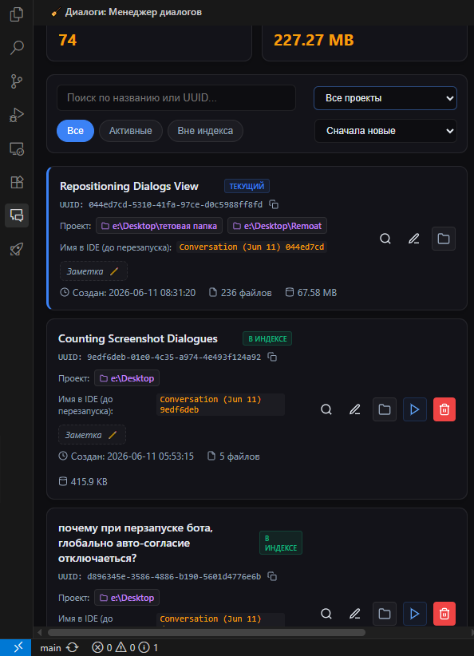
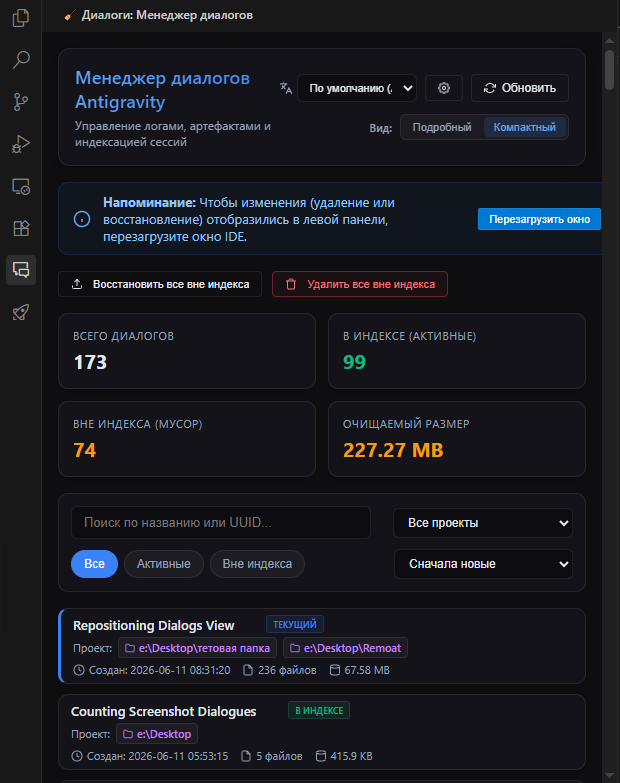
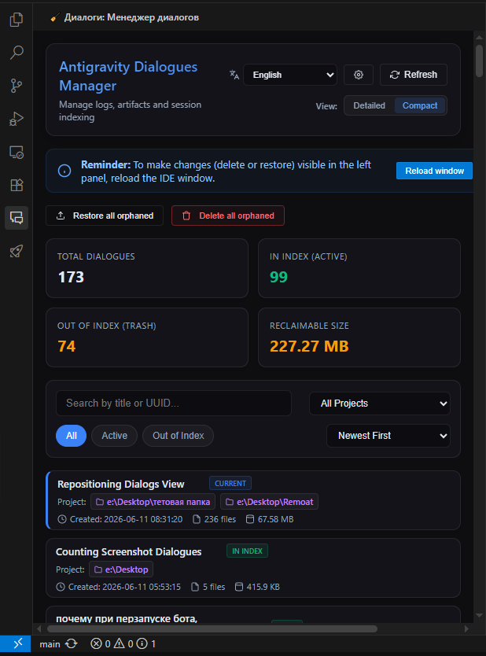

# Antigravity Chat Manager

[Русский](#русский) | [English](#english)

> ⚠️ **Эксклюзивно для Antigravity IDE 2.0+**: Данное расширение разработано специально для Antigravity IDE и не совместимо со стандартным VS Code.
> 
> **Exclusive for Antigravity IDE 2.0+**: This extension is designed specifically for Antigravity IDE and is not compatible with standard VS Code.

---

## Русский

**Antigravity Chat Manager** — это премиальное расширение для Antigravity IDE, предоставляющее удобный визуальный интерфейс для управления локальными диалогами (чатами) искусственного интеллекта на локальном диске и в индексе среды разработки. Расширение создавалось с особым вниманием к деталям — до каждой кнопки и строки интерфейса, чтобы обеспечить плавный и качественный опыт использования.

### Установка и скачивание
Готовый пакет расширения `.vsix` можно скачать со страницы релизов:
👉 **[Последние релизы (VSIX)](https://github.com/MaximXR/Antigravity-Chat-Manager/releases)**

После скачивания файла установите его в Antigravity IDE (меню *Extensions* -> кнопка *... (Views and More Actions)* -> *Install from VSIX...*).

> 💡 **Собственная сборка из исходников:**
> Вместо скачивания готового релиза вы можете скомпилировать расширение самостоятельно. Для этого просто запустите файл `build.bat` в корневом каталоге проекта — он автоматически проверит и установит необходимые зависимости, выполнит сборку и создаст актуальный `.vsix` файл в папке `dist/`.

### Какие проблемы решает расширение?

1. **Потеря диалогов (выпадение из индекса)**:
   Antigravity IDE со временем вытесняет старые диалоги из левой панели истории (индекса). При этом файлы диалога (логи, файлы шагов, артефакты) остаются лежать на диске в виде «мусора». Расширение находит такие осиротевшие чаты на диске и позволяет в один клик:
   - **Восстановить** их обратно в историю чатов IDE.
   - **Удалить** их физически, освободив занятое дисковое пространство.
2. **Трудность ориентирования в диалогах**:
   В стандартном интерфейсе IDE сложно ориентироваться, когда диалогов становится много. Расширение решает эту проблему с помощью:
   - Фильтрации диалогов по конкретным проектам (рабочим областям).
   - Полнотекстового поиска по заголовкам и UUID.
   - Сортировки по дате создания, объёму файлов на диске и имени.
   - **Пользовательских заметок (аннотаций)** для каждого диалога.
   - Специального фильтра **«С заметками»**, позволяющего быстро находить чаты, в которые вы добавили важные текстовые комментарии.

### Основные возможности
- **Мониторинг диска**: Отображает размер файлов диалога, количество связанных файлов на диске и точное время создания.
- **Детекция мусора (Осиротевших диалогов)**: Показывает, какие диалоги находятся в индексе (активные), а какие были удалены из индекса (но остались на диске как мусор).
- **Пользовательские заметки**: Возможность быстро добавлять, редактировать (кликнув на строку заметки) и удалять текстовые заметки к диалогам прямо в карточке (поле ввода растягивается на 100% ширины карточки для удобства набора).
- **Два режима отображения**:
  - **Подробный вид (Detailed)**: Отображает всю техническую информацию, списки связанных воркспейсов, размеры файлов на диске и кнопки копирования метаданных.
  - **Компактный вид (Compact)**: Максимально лаконичное представление чатов в виде аккуратных строк, оптимизированное для работы с большими списками.
- **Автоматическая прокрутка при запуске**: Настройка `antigravity-chat-manager.scrollPosition` позволяет выбрать, до какого элемента прокручивать страницу при открытии панели (в самый верх, до панели фильтров или сразу к началу списка чатов).
- **Фильтр по проектам**: Удобный селектор проектов для отображения диалогов, принадлежащих только выбранному воркспейсу.
- **Массовые операции**: 
  - **Восстановить все вне индекса** — возвращает все осиротевшие чаты обратно в боковую панель истории IDE.
  - **Удалить все вне индекса** — полностью и физически очищает файлы осиротевших чатов с диска для освобождения места (если некоторые файлы заблокированы IDE, они будут аккуратно пропущены с выводом отчета, а успешно удаленные файлы освободят дисковое пространство).
- **Индивидуальные действия**:
  - Открытие папки диалога на диске.
  - Поиск файлов диалога по UUID.
  - Копирование названия и UUID чата в буфер обмена одним кликом.
  - Удаление или восстановление конкретного диалога.
- **Настройка иконок**: Возможность переключить стиль иконки боковой панели (чат/диалог или корзина) через стандартные настройки VS Code.
- **Интеграция с IDE**: Кнопка быстрого открытия настроек (шестерёнка ⚙️) и кнопка перезагрузки окна для мгновенного применения изменений истории в левой панели.
- **Кроссплатформенность**: Работает на Windows, macOS и Linux.
- **Двуязычный интерфейс**: Автоматически переключается на русский или английский язык в зависимости от системной локали IDE.

> ℹ️ **Где хранятся заметки?**
> Заметки хранятся локально на вашем компьютере в глобальной папке `~/.gemini/antigravity-ide/annotations/<uuid>_note.txt`. Это предотвращает засорение рабочей области проекта служебными файлами и позволяет автоматически удалять файлы заметок с диска при физическом удалении диалогов.

> ⚠️ **Важное ограничение блокировки файлов IDE:**
> Если диалог открывался или редактировался в текущей сессии IDE, его файлы блокируются самой средой разработки. 
> - Перед физическим удалением такого чата (кнопкой «Удалить») необходимо выполнить **перезапуск окна Antigravity IDE (Reload Window / Ctrl+R)**, чтобы снять блокировку с файлов на диске.
> - Аналогично, если вы восстановили потерянный чат в индекс, рекомендуется сделать **перезапуск окна (Reload Window)** перед его открытием для правильной инициализации IDE.

### Скриншоты / Screenshots

#### Подробный вид (Detailed View)


#### Компактный вид (Compact View)


### Рекомендуемые расширения-компаньоны
- **[Antigravity Plugin Manager](https://github.com/MaximXR/Antigravity-Plugin-Manager)** — удобный визуальный контроллер плагинов, правил и навыков для тонкой настройки контекста ИИ-агентов.

### Системные требования и Совместимость
- Разработано специально для **Antigravity IDE**.
- Совместимо со всеми операционными системами: **Windows, macOS, Linux**.
- Автор тестировал и проверял работу расширения преимущественно на **Windows 10**.
- Требуется установленный интерпретатор Python 3 (`python` или `python3` в системном PATH) для работы фоновой службы.

---

### Обращение автора / Author's Note ❤️
Это мое первое расширение для Antigravity IDE, которое я опубликовал на GitHub и в маркетплейсе **Open-VSX.org**. Я очень старался сделать его качественным, продуманным до мелочей и удобным в повседневном использовании — как настоящий премиальный продукт!
Если вам понравилось расширение или оно сэкономило вам время:
- Пожалуйста, поставьте звездочку 🌟 нашему **[GitHub репозиторию](https://github.com/MaximXR/Antigravity-Chat-Manager)**.
- Оставьте отзыв на **[Open-VSX.org](https://open-vsx.org/extension/MaximXR/antigravity-chat-manager)**.
Ваша поддержка дает мне маленькое и приятное признание того, что я старался не зря! Спасибо!

---

## English

**Antigravity Chat Manager** is a premium extension for Antigravity IDE that provides a convenient visual interface to manage AI dialogues (chats) on your local disk and in the development environment index. The extension is built with careful attention to detail — down to every button and line of the interface, to ensure a smooth and premium user experience.

### Installation & Download
You can download the compiled `.vsix` extension file from the GitHub releases page:
👉 **[Download Latest Releases (VSIX)](https://github.com/MaximXR/Antigravity-Chat-Manager/releases)**

After downloading, install it in Antigravity IDE (via *Extensions* menu -> click *... (Views and More Actions)* -> *Install from VSIX...*).

> 💡 **Building from Source:**
> Instead of downloading a pre-built release, you can compile the extension yourself. Simply run the `build.bat` script in the project root directory — it will check and install dependencies, package the extension, and output the compiled `.vsix` file to the `dist/` folder.

### What Problems Does It Solve?

1. **Dialogue Loss (Orphaned Chats)**:
   Antigravity IDE eventually displaces older dialogues from the history panel (index). However, their logs, step files, and artifacts remain on the disk as clutter. The extension scans your disk, highlights these orphaned chats, and lets you:
   - **Restore** them back to the IDE history panel.
   - **Delete** them physically to reclaim storage space.
2. **Hard Navigation**:
   It is hard to navigate and search through a flat list of numerous dialogues inside the IDE. The extension solves this by offering:
   - Filtering dialogues by specific projects (workspaces).
   - Full-text search by titles or UUIDs.
   - Sorting by creation date, disk size, or name.
   - **Custom annotations (notes)** for every dialogue.
   - **"With Notes"** filter to instantly find chats where you added custom text comments.

### Key Features
- **Disk Monitoring**: Displays dialogue file size, the number of associated files on disk, and precise creation timestamps.
- **Orphan / Trash Detection**: Identifies which dialogues are indexed (active) and which have been unindexed (orphaned files remaining on disk).
- **Custom Annotations**: Add, edit (by clicking the note row), and delete notes for dialogues directly in their cards (the input box stretches to 100% card width for easier typing).
- **Two Layout Modes**:
  - **Detailed View**: Displays all technical information, workspace mappings, disk file counts, and copy metadata buttons.
  - **Compact View**: Sleek, single-line dialogue display optimized for managing very large lists.
- **Startup Auto-Scroll**: The `antigravity-chat-manager.scrollPosition` setting allows you to choose where the webview scrolls on startup (page top, filters bar, or start of the dialogue list).
- **Project Filter**: Workspace selector to display dialogues belonging only to the selected workspace.
- **Bulk Operations**:
  - **Restore all orphaned** — returns all orphaned dialogues back to the IDE history panel.
  - **Delete all orphaned** — permanently erases orphaned dialogue files from disk to reclaim storage space (any files locked by the active IDE session will be gracefully skipped with a report, while unlocked ones are successfully wiped).
- **Individual Actions**:
  - Open dialogue directory on disk.
  - Search dialogue files on disk by UUID.
  - Copy title or UUID to clipboard with a single click.
  - Delete or restore a specific dialogue.
- **Customizable Icons**: Toggle between chat/dialogue icon and trash icon for the sidebar panel via standard VS Code settings.
- **IDE Integration**: Quick settings button (gear icon ⚙️) and window reload button to instantly apply changes in the left history panel.
- **Cross-Platform**: Fully compatible with Windows, macOS, and Linux.
- **Localization**: Automatically switches between English and Russian based on your IDE locale settings.

> ℹ️ **Where Are the Notes Stored?**
> Notes are saved locally on your computer in the global folder `~/.gemini/antigravity-ide/annotations/<uuid>_note.txt`. This keeps your project workspace files completely clean and ensures that note files are automatically deleted when the dialogue is erased.

> ⚠️ **Important IDE File Lock Limitation:**
> If a dialogue was opened or edited in your current IDE session, its files are locked by the IDE application.
> - Before permanently deleting such a chat (via the "Delete" button), you must perform a **Reload Window (Ctrl+R)** in Antigravity IDE to release the locks on the disk files.
> - Similarly, if you have just restored an orphaned dialogue back to the history list, we recommend performing a **Reload Window** before opening it to ensure correct initialization.

### Screenshots

#### Detailed View


#### Compact View


### Recommended Companion Extensions
- **[Antigravity Plugin Manager](https://github.com/MaximXR/Antigravity-Plugin-Manager)** — a visual controller for global plugins, rules, and skills to fine-tune active AI context parameters.

### Prerequisites & Compatibility
- Designed specifically for **Antigravity IDE**.
- Compatible with all operating systems: **Windows, macOS, Linux**.
- Tested and verified by the author on **Windows 10**.
- Python 3 interpreter (`python` or `python3` in PATH) is required to run the backend service.

---

### Author's Note ❤️
This is my first extension for Antigravity IDE published on GitHub and **Open-VSX.org**. I did my absolute best to make it high-quality, polished to the smallest detail, and convenient for daily use — like a real premium product!
If you like the extension or it saved you some time:
- Please give a star 🌟 to our **[GitHub Repository](https://github.com/MaximXR/Antigravity-Chat-Manager)**.
- Write a review on **[Open-VSX.org](https://open-vsx.org/extension/MaximXR/antigravity-chat-manager)**.
Your support gives me a small and pleasant recognition that I worked hard for a good reason! Thank you!

---

## Сборка расширения / Packaging

Для сборки расширения в готовый файл `.vsix`, выполните команду в корневой папке проекта:
```bash
./build.bat
```
To build the extension into a `.vsix` file, run the following command in the project root:
```bash
./build.bat
```
